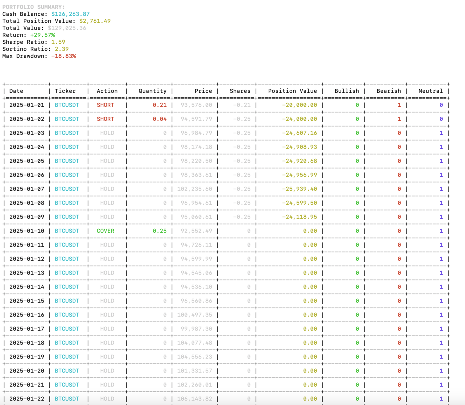

# AI Hedge Fund Crypto

This is a proof of concept for an AI-powered hedge fund for cryptocurrency trading. The goal of this project is to explore the use of AI to make trading decisions in the crypto market. This project is for **educational** purposes only and is not intended for real trading or investment.

> **Note:** This is a fork of the [ai-hedge-fund](https://github.com/virattt/ai-hedge-fund) project, adapted specifically for cryptocurrency trading. The codebase is still in active development.

## Architecture

This system employs several agents working together:

1. Technical Analyst Agent - Analyzes technical indicators and generates trading signals
2. Risk Manager Agent - Calculates risk metrics and sets position limits
3. Portfolio Manager Agent - Makes final trading decisions and generates orders

**Note**: The system simulates trading decisions; it does not actually trade.

## Disclaimer

This project is for **educational and research purposes only**.

- Not intended for real trading or investment
- No warranties or guarantees provided
- Past performance does not indicate future results
- Creator assumes no liability for financial losses
- Consult a financial advisor for investment decisions

By using this software, you agree to use it solely for learning purposes.



## Table of Contents
- [Setup](#setup)
- [Usage](#usage)
  - [Running the Hedge Fund](#running-the-hedge-fund)
  - [Running the Backtester](#running-the-backtester)
- [Project Structure](#project-structure)
- [Contributing](#contributing)
- [Feature Requests](#feature-requests)
- [License](#license)

## Setup

Clone the repository:
```bash
git clone https://github.com/yourusername/ai-hedge-fund-crypto.git
cd ai-hedge-fund-crypto
```

1. Install Poetry (if not already installed):
```bash
curl -sSL https://install.python-poetry.org | python3 -
```

2. Install dependencies:
```bash
poetry install
```

3. Set up your environment variables:
```bash
# Create .env file for your API keys
cp .env.example .env
```

4. Set your API keys:
```bash
# For running LLMs hosted by openai (gpt-4o, gpt-4o-mini, etc.)
# Get your OpenAI API key from https://platform.openai.com/
OPENAI_API_KEY=your-openai-api-key

# For running LLMs hosted by groq (deepseek, llama3, etc.)
# Get your Groq API key from https://groq.com/
GROQ_API_KEY=your-groq-api-key

# For getting financial data to power the hedge fund
# Get your Binance API key from https://www.binance.com/
BINANCE_API_KEY=your-binance-api-key
BINANCE_API_SECRET=your-binance-api-secret
```

**Important**: You must set `OPENAI_API_KEY` or `GROQ_API_KEY` for the hedge fund to work. If you want to use LLMs from all providers, you will need to set all API keys.

## Usage

### Running the Hedge Fund
```bash
poetry run python src/main.py
```
You can edit parameters directly in the script if needed.

### Running the Backtester

```bash
poetry run python src/backtest.py
```

The backtester supports command-line options like `--ticker`, `--start-date`, `--end-date`, and `--capital`.

**Example Output:**


**Example Backtest Results:**


**Performance Chart:**


## Project Structure 
```
ai-hedge-fund-crypto/
├── src/
│   ├── agents/                   # Agent definitions and workflow
│   │   ├── portfolio_manager.py  # Portfolio management agent
│   │   ├── risk_manager.py       # Risk management agent
│   │   ├── technicals.py         # Technical analysis agent
│   ├── api/                      # API integrations 
│   │   ├── binance_api.py        # Binance API integration
│   ├── backtester/               # Backtesting components
│   │   ├── backtester.py         # Backtesting implementation
│   ├── graph/                    # Workflow graphs
│   │   ├── create_workflow.py    # Creates agent workflow
│   │   ├── state.py              # State management
│   ├── utils/                    # Utility functions
│   │   ├── analysts.py           # Analyst configuration
│   │   ├── display.py            # Display functions
│   ├── backtest.py               # Backtesting entry point
│   ├── main.py                   # Main entry point
├── pyproject.toml                # Poetry configuration
├── .env.example                  # Example environment variables
├── ...
```

## Contributing

1. Fork the repository
2. Create a feature branch
3. Commit your changes
4. Push to the branch
5. Create a Pull Request

**Important**: Please keep your pull requests small and focused. This will make it easier to review and merge.

## Feature Requests

If you have a feature request, please open an issue and make sure it is tagged with `enhancement`.

## License

This project is licensed under the MIT License - see the LICENSE file for details.

## Referral Links

If you're interested in trading cryptocurrency on Binance, you can use the referral link below to receive a discount on trading fees:

[Binance Futures Referral Link](https://www.binance.com/futures/ref/51bitquant) - Sign up with this link to get a fee discount when trading on Binance Futures.
